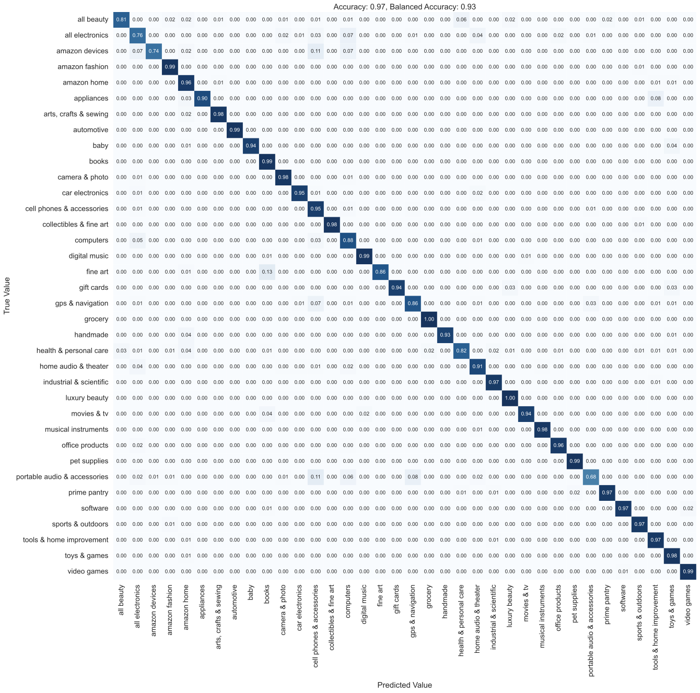
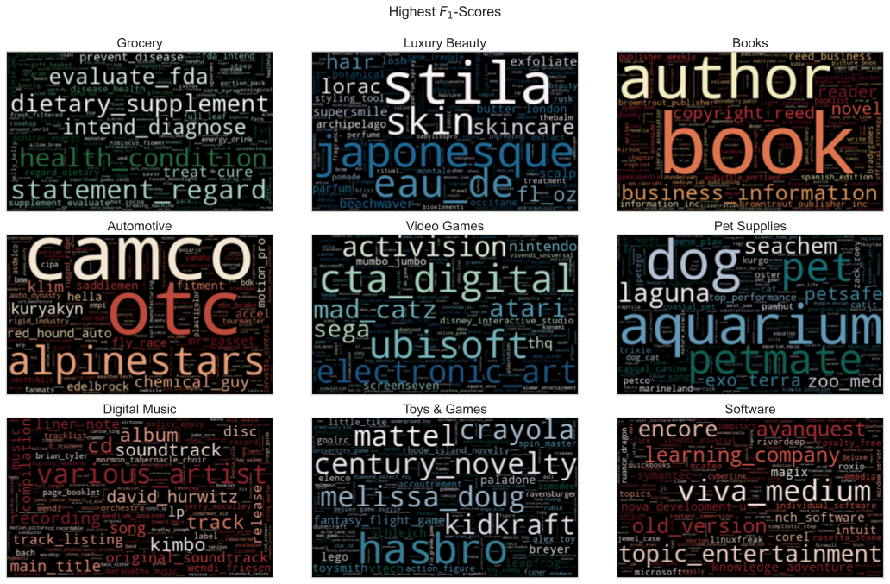

# Business Problem

Amazon has (fictitiously) asked me to build a product classifier for two purposes: (1) integrating new products into their classification scheme, and (2) flagging products which are probably misclassified. They requested that I make some recommendations related to product classification and its uses.

Accuracy is my highest priority, but I have a taste for interpretability and transparency, so the classifier I develop is sure to yield some insights about the data.

# Dataset

The Amazon product data I've chosen doesn't come directly from Amazon, but rather from three AI researchers, Jianmo Ni, Jiacheng Li, and Julian McAuley, who scraped it for their paper "Justifying Recommendations using Distantly-Labeled Reviews and Fine-grained Aspects." The review data extends from May 1996 to October 2018, which is about when they released the update. Their focus was primarily on reviews, but the dataset also has metadata for ~15-million products.

# Repository Guide

### Initial Download and Cleaning

See `big_clean.ipynb` to download the data (~13GB), convert it to a Apache Parquet format, clean it, and export it for use in `main_notebook.ipynb`. If you have less than 32GB of RAM, you may have difficulties processing the large dataset.

### Feature Engineering and Modeling

See `main_notebook.ipynb` for the vocabulary engineering, train-test-split, and model development. In `production_refit.ipynb`, a production-grade model is fit on the full dataset and equipped with advanced built-in preprocessing. To be clear, the final model is trained on the full *modeling* dataset (~1M samples), not the full 15M.

### Demo Web App

I've created a small [web app](https://share.streamlit.io/ndgigliotti/amazon-product-classifier/demo/demo.py) for playing around with the classifier. The app makes it easy to experiment with classifying new products, using a dataset from Walmart. The minimal cleaning done on the Walmart data can be found in `demo_data_prep.ipynb`.

### Slideshow Presentation

A PowerPoint presentation can be found in the `presentation` directory, along with PDF copies of the notebooks.

# Methods
1. Curate corpus for training:
    - Drop shortest 50% of descriptions
    - Drop extremely long outliers
Select only top brands in each category
2. Rigorous preprocessing:
    - Transliterate to ASCII
    - Filter out numerals, punctuation
    - Filter out stop words, repetitive sequences
    - Restrict token length (2-16 characters)
3. Feature engineering:
    - Multi-word brand terms
    - Extract bigrams (2-word phrases) from **each category**
4. Binary TF*IDF vectorization:
    - Binary occurrence markers {0, 1}
    - IDF weighting to emphasize rare terms
    - Normalize to reduce effect of document length
5. Support Vector Machine with SGD Optimization
   - Efficient on large datasets with 1M or more documents

## Final Model

The final model is a linear support-vector machine (hinge loss). It is 97% accurate&mdash;a solid score, especially since I used only highly interpretable, tried-and-true methods.

The 'adaptive' learning rate continues at a constant rate of $eta_0$ until the stopping criterion is reached. Then, instead of stopping, the algorithm divides the learning rate by 5 and continues. Learning only stops when the learning rate drops below 1e-6. For my dataset, training with 'adaptive' took about five times as long as training with the default.

    Pipeline(steps=[('vec',
                     TfidfVectorizer(binary=True, lowercase=False,
                                     token_pattern='(?i)\\b[a-z_]{2,16}\\b')),
                    ('cls',
                     SGDClassifier(alpha=5.25503769545935e-07, average=True,
                                   class_weight='balanced', eta0=0.8416663608926325,
                                   learning_rate='adaptive', n_jobs=-1))],
             verbose=True)

    

    

# Results

There are a lot of brand terms at the forefront, as I expected. However, There is also some category-specific fine print that shows up, especially in Grocery and Books. Legalistic phrases like "evaluated_fda", "fda_intended, "copyright_reed", and "rights_reserved" are among the top coefficients for these categories. This is probably because boilerplate category-related legalistic text appears repeatedly throughout the category, but does not appear in other categories.

# Conclusion

I developed a highly accurate 36-class classifier for Amazon products using tried-and-true machine learning methods. One reason the model attained such a high score is that I selected a very high quality dataset. Amazon product data is both plentiful and well-labeled. The human-given category labels are highly accurate. Why? Because on Amazon, people's livelihoods are on the line (including Amazon's). It matters to sellers how they classify their products, and it matters to you too. Classification matters to businesses because it matters to customers&mdash;it can determine whether a customer buys a product or never even hears about it.

#### If you're looking to classify products with NLP, lead with the brand terms.

Brand terms ranked high in nearly every category. One could build a decent model with *only* brand terms, though I wouldn't recommend going that far. Even if you wanted an image-based classifier, brands are the first place I'd start. 

#### Don’t ignore legalistic text, because sometimes it’s category-specific.

In fact, I recommend you gather up all the legalistic caveats and copyright statements you can get. Legalistic text is sometimes very distinctive of its category.

#### Use the model to study your competitors and scope out new suppliers.

This model can be used to analyze other business' inventories, including those of competitors. Discover new products and suppliers by directly comparing their inventories to yours under your classification scheme. See how their classification differs from yours by examining how the categories line up.

# Looking Forward

- Gather data on brands concerning their relationships and parent companies.
    - Try to expand the model's coverage to more obscure brands.
- Develop a workflow to create specialized subcategory models for each major category.
    - These will be **multilabel** classification models.
